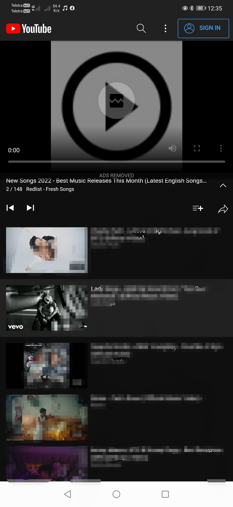

# ProTube, YouTube JS Hooks
ProTube was my attempt at making a JavaScript browser extension for Android devices.

1, The Plan    
> The project uses a WebView with JavaScript reflection - for accessing websites using cookie session storage, it will retrieve the data from a URL.      
     
2, Intercepted Ads       
> The data returned from m.youtube, is intercepted via adding additional JavaScript to each page - when you load YouTube, a script will be generated based on the page and then injected to the page to remove any advertising.    
   
3, Hooking        
> The main concept was designed to implement JavaScript hooking and reflection similiar to "JavaScript Browser Extensions" on Desktop computers.
       
4, Removing Advertisement,        
> Servers are used to load a direct link to the MP4 of the current page, when the video is is identified it will completely remove the office YouTube player and then inject a custom HTML5 player into the page instead - the custom HTML5 player is ver basic and only needs to load a video to replace the official one that includes advertisement.     
- 3x servers added for example         
     
5, Enabling AutoPlay
> AutoPlay was achieved by using a JavaScript timeout function, the video duration is extracted and then used to generate a script for a redirection after the video ends.  - it is off by about 3 seconds.    
> Redirection is achieved by loading the "Up Next" list into an array of id's ( Up Next Array )    
      
6, Enabling Background Playback on Android 10+    
> Background playback is disabled as Android 10 has changed the possibility to run an application in the background - instead one must run a service and show a notification at all times - the notification must be updated to keep the service running otherwise it'll be killed by the memory cleaner.       
> To get around Android 10+ restrictions, it will run a constant dummy service in the background that just updates the notification with "Playing Now".   
  
7, Allowing Downloading like Premium,    
> Downloads are achieved very easily - the link for the MP4 stream is just sent to the user to initiate a download via the system download manager.    
   
8, I hate multiple activities - so enjoy the hell storm 1 pagers.

### History   
Android devices are slowly being migrated to include Google Chrome as the default web browser for Android device's, However the Android version of Google Chrome does not allow installing JavaScript Extensions like the desktop counterpart, the only way around this is to use a custom web browser that has javascript interfaces designed specifically for injection of JavaScript, Resource Loading overrides and Page load control.    
    
### How Does it Work ?   
The main concept of this implementation is to mimic a famous Google Chrome extension on Desktop PC's called "AD Block for YouTube".     
   
The ProTube Project uses JavaScript injection on every page load to not only replace the video frame with a direct link from google service's ( bypassing in-video advertising ) via a third-party GitHub project that can be found by searching "YouTube Download for PHP", it also identifies and removes advertising on each page that i could identify in 3 days of testing - it does this removal of advertisng every 100 milliseconds.        
    
Purely for Testing purposes, i also tried to make it support background playback - the background playback is therefore buggy and needs some work.      
   
    
## Features     
> Ad' Free browsing of YouTube with similar features to Premium.
     
- Page and In-Video advertising removal       
- Background Playback"ish"    
- 3 Server cycling on errors       
- Off Screen Playback"ish"     
- Next Video Identification    
- AutoPlay Implementations for both Playlists and the What's Next list     
